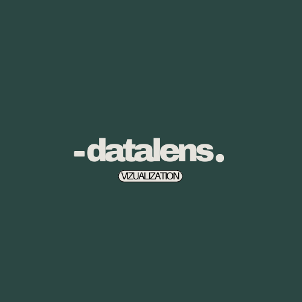
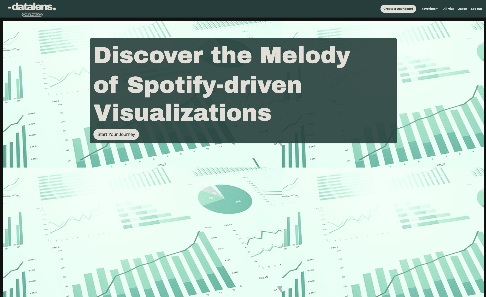

 

  

  <h3 align="center">Data-Lens</h3>

  

    Discover the Melody of Spotify-driven Visualizations!
     
     
    <a href="https://data-lens.onrender.com/">View Demo</a>
    .
  

    

## Table Of Contents

- [Table Of Contents](#table-of-contents)
- [About The Project](#about-the-project)
- [Built With](#built-with)
- [Usage](#usage)
- [Authors](#authors)
- [Acknowledgements](#acknowledgements)

## About The Project

The goal of this project was to develop a web-based data visualization platform that provides interactive and customizable data visualizations without requiring users to have log in access to a data visualization server (Tableau/Power BI). The platform will allow users to create custom views, explore different data visualizations (such as bar charts, line graphs, box and whisker plots, etc.), and utilize filters and drill-downs for enhanced data analysis. My aim was to provide an accessible and user-friendly data visualization solution that can provide a fun and interesting look into your Spotify playlists.

## Built With

Python, Flask, SQLAlchemy, Plotly, Pandas, Dash, HTML, CSS, Bootstrap, and Spotipy were all used in the creation of this project. 

API [here](https://api.spotify.com/v1)

Schema Files [here](https://dbdiagram.io/d/645d8cebdca9fb07c4f0f1e8)

## Usage

* A new user should first create an account using the sign up page. An important note, the username should match the Spotify username in order for this app to function correctly. 
* Once a new user has been created, they are redirected to a home page where they can "Start their Journey" and this button begins the data pull from their public Spotify playlists. Once this step is complete they should be routed to a dashboard page where they can view all available visualizations that were created with their data. 
* If a user wants to create a custom dashboard of specific visuals, there is a button to "Create a Dashboard" which allows for a semi-custom dashboard creation. 
* Finally, there is a user page where you can edit information like name and username as well as a delete account option. 

## Authors

* **Jason Scott** - *Springboard Bootcamp Student* - [Jason Scott](https://github.com/jasonscotch) - *Built Entire Project*

## Acknowledgements

* [ImgShields](https://shields.io/)
* [Spotipy](https://spotipy.readthedocs.io/en/2.22.1/#)
